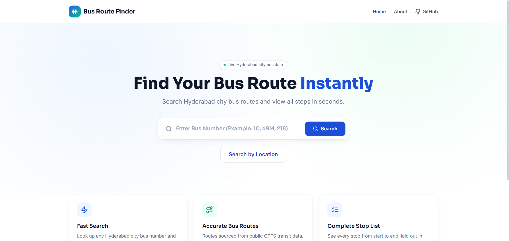
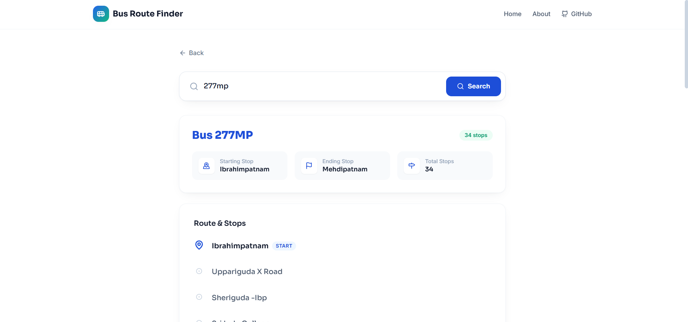
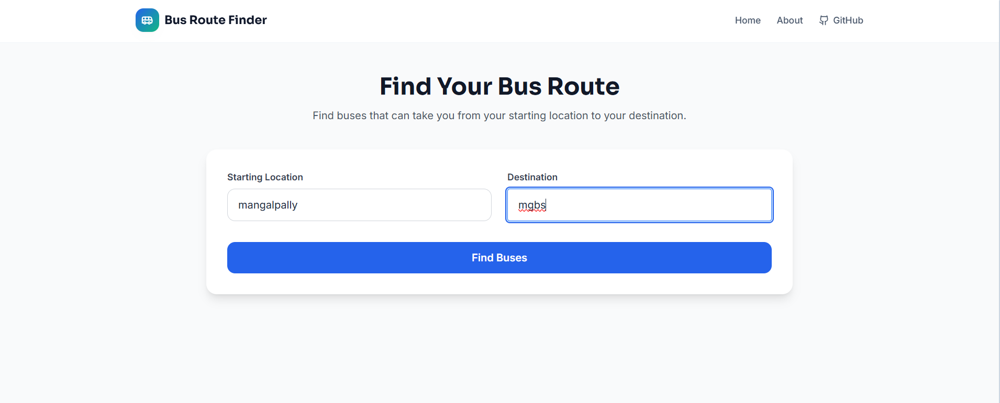
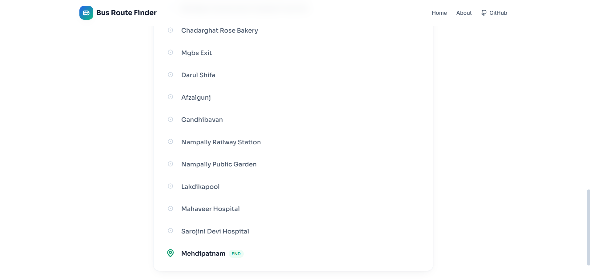

# 🚍 Bus Route Finder

A web-based application that helps users find Hyderabad bus routes and stops easily by searching for a bus number or by specifying a source and destination.

## 📌 About the Project

Finding the correct bus route and understanding all the stops along the way can be difficult when route information is scattered across different sources.

**Bus Route Finder** provides a simple interface where users can search for:

- 🚌 A specific bus number
- 📍 Buses between a source and destination

The application retrieves route information and displays available buses and their stops in an easy-to-understand format.

## 🎯 Problem Statement

Passengers often need to know:

- Which bus should they take?
- What stops does a particular bus cover?
- Which buses can travel between two locations?

The goal of this project is to provide this information through a simple and user-friendly web application.

## 💡 Proposed Solution

Bus Route Finder uses public transportation data in **GTFS (General Transit Feed Specification)** format, stores the processed data in **MongoDB**, and provides REST APIs through an **Express.js** backend.

The **React** frontend communicates with the backend and presents the route information to the user.

## ✨ Features

### 🚌 Search by Bus Number

Users can enter a bus number to view:

- Starting point
- Destination
- Total number of stops
- Complete list of stops

### 📍 Search by Location

Users can enter a source and destination to find available bus routes connecting them.

### 📋 Detailed Stop Information

Routes are displayed with an ordered list of stops for easy navigation.

### 📱 User-Friendly Interface

A simple and responsive interface designed for quick and convenient route searching.

## 🛠️ Technologies Used

### Frontend

- React.js
- Vite
- JavaScript
- Tailwind CSS
- Axios
- React Router

### Backend

- Node.js
- Express.js
- Mongoose

### Database

- MongoDB Atlas

### Data

- GTFS (General Transit Feed Specification)

### Deployment

- Vercel — Frontend
- Render — Backend
- MongoDB Atlas — Database

## ⚙️ How It Works

```text
User
  ↓
React Frontend
  ↓
Express.js REST API
  ↓
MongoDB Atlas
  ↓
GTFS Transportation Data
  ↓
Bus Route Information
  ↓
Displayed to User
```

## 📂 Project Structure

```text
BUS-ROUTE-FINDER
│
├── README.md
├── screenshots
│   ├── home.png
│   ├── bus-number.png
│   ├── location-search.png
│   └── route-results.png
│
├── client
│   ├── src
│   │   ├── components
│   │   ├── pages
│   │   ├── services
│   │   ├── App.jsx
│   │   ├── index.css
│   │   └── main.jsx
│   ├── package.json
│   └── vite.config.js
│
└── server
    ├── config
    ├── controllers
    ├── models
    ├── routes
    ├── scripts
    ├── gtfs
    ├── server.js
    └── package.json
```

## 🗄️ Data Source

The application uses GTFS-based public transportation data containing information such as:

- Bus routes
- Stops
- Trips
- Stop times

The data is processed and stored in MongoDB and accessed through the backend API.

## 🚀 Getting Started

These instructions are for anyone who wants to run the project locally.

### 1. Clone the repository

```bash
git clone https://github.com/varshini-347/bus-route-finder.git
cd bus-route-finder
```

### 2. Install frontend dependencies

```bash
cd client
npm install
```

### 3. Start the frontend

```bash
npm run dev
```

### 4. Install backend dependencies

Open another terminal:

```bash
cd server
npm install
```

### 5. Configure environment variables

Create a `.env` file inside the `server` folder:

```env
MONGO_URI=your_mongodb_connection_string
PORT=5000
```

### 6. Start the backend

```bash
npm start
```

## 🌐 Live Demo

### Frontend

[🚍 Bus Route Finder - Live Website](https://bus-route-finder-gilt.vercel.app/)

### Backend API

[🔧 Bus Route Finder - Backend API](https://bus-route-finder-api.onrender.com/)

## 📸 Screenshots

### 🏠 Home Page



### 🚌 Bus Number Search



### 📍 Search by Location



### 📋 Route Results



## 🔮 Future Scope

- 🗺️ Interactive route maps
- 📍 GPS-based nearby bus search
- 🕐 Real-time bus tracking
- ⏱️ Estimated bus arrival times
- ⭐ Favorite routes
- 📱 Progressive Web App or mobile application

## 👩‍💻 Author

**Varshini**

[GitHub Profile](https://github.com/varshini-347)
